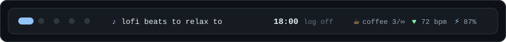

<p align="center">
  
</p>

<p align="center">
  
</p>

<p align="center">
  
</p>

<p align="center">
  
</p>

<p align="center">
  
</p>

<details>
<summary><code>do not open</code></summary>

```console
bbxs@linux:~$ sudo rm -rf / --no-preserve-root
[sudo] password for bbxs:
bbxs is not in the sudoers file. This incident will be reported.
```

</details>
